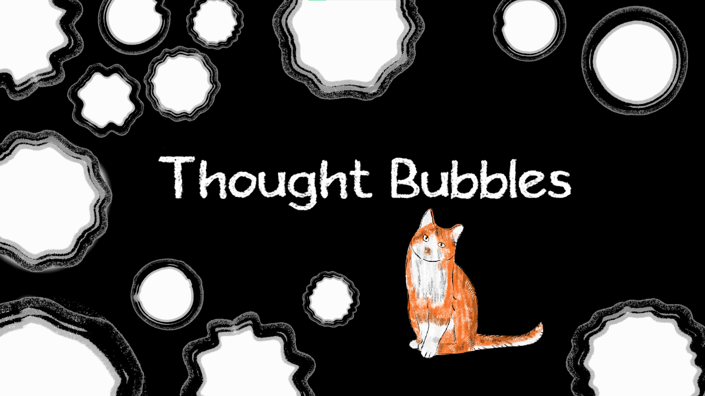

# Thought Bubbles

This is a polishing-up of a 2025 HKU Global Gamejam submission 'Thought Bubbles'. I thought both the art and general idea were too cool to not be finalized, so after the game jam I worked on getting it to the finished state you can see here.

The game is a 5-minute narrative experience, made to be played once, in one sitting from start to finish.
To download the playable demo, go to: https://tudormacovei.itch.io/thought-bubbles

# Gameplay Slice

# Contribution, Challenges
During the game jam, my main contribution was creating the softbody physics of the thought bubbles. This was much more difficult than expected, since Unity has no native way of simulating softbody objects. I started out by using the approach most popular in the comunity, which is using bones to deform a 2D sprite, then linking these bones together to create a rough softbody simulation. Using this simple approach would often break, especially when spawning softbody objects next to each other, so I had to make some additions to the softbody objects. These additions incuded:
 - Creating a 'safezone' collider at the moment of object creation, which clears out the area in which the object will be spawned.
 - Adding an inner circle collider to prevent the softbody from deforming too much.

Additionaly, creating the thought bubbles presented a new challenge: animating a deforming sprite. In Unity, deformation is performed per-sprite, by creating a 2D rig for each sprite you want to deform. Therefore sprite animation cannot be done while perserving the deformation from frame to frame. The solution I came up with was creating an animated 2D Shader, which uses Game Time as an input parameter, and cycles through a Texture Array to change the texture currently displayed on the thought bubble. This shader is fully parametrized, so I then could easily randomize the texture set being shown on each thought bubble. As can be seen in the 'Gameplay Slice' .gif, bubbles have different textures attached to them, and the animations are also randomly offset, to make each bubble visually distinct.
